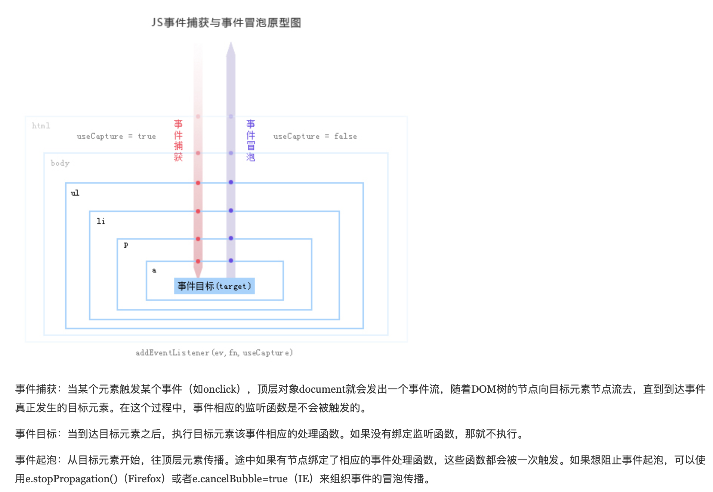

## 事件流

从页面中接受事件的顺序包括三个阶段，事件捕获阶段，处理目标阶段，事件冒泡阶段
	
	
## 事件代理

当我们需要对很多元素添加事件的时候，可以通过将事件添加到它们的父节点而将事件委托给父节点来触发处理函数。这主要得益于浏览器的事件冒泡机制。

## 事件代理使用情景
```html
<body>
    <div>
        <p id="p1">激活</p>
        <p id="p2">取消</p>
        <p id="p3">取消</p>
        <p id="p4">取消</p>
    </div>
    <div>
        <p id="p5">取消</p>
        <p id="p6">取消</p>
    </div>
</body>
```
点击p时打印出相应的文字，～～给每个p绑定一个点击事件？～～ 用事件冒泡，p上的点击事件会冒泡到div再到body，所以给body绑定点击事件即可。特殊的点击事件单独绑定并阻止向上冒泡```e.stopPropagation()）```
```js
  let body=document.body
    let p=document.getElementById('p1')
    function bindEvent(elem, type, fn) {
        elem.addEventListener(type, fn)
    } 
    bindEvent(body,'click',()=>{
        console.log("取消"); 
    })
    bindEvent(p,'click',(e)=>{
        console.log("激活"); 
        e.stopPropagation()
    })
```

优点：

1. 代码简洁
2. 减少内存

 
## 通用事件绑定
```js       
//el被监听的节点
//type事件类型
//fn事件触发后要执行的函数
 
//简易版
function bindEvent(el,type,fn) {
    el.addEventListener(type,fn)
}
 
const el=document.getElementById('root')
bindEvent(el,'click',event=>{
    event.preventDefault()//阻止默认行为
    // event.stopPropagation()//阻止向上冒泡
    alert(event.target.innerText);
})
 
//完整版
//selector 父元素有多种子元素时，通过selector来过滤需要监听的元素
function bindEvent(el,type,selector,fn) {
    //selector可能没有传入
    if(fn==null){
        fn=selector
        selector=null
    }
    el.addEventListener('click',e=>{
        if(selector){
            const target=e.target
            //mactches 检验DOM节点是否匹配
            if(target.matches(selector)){
                fn(e)
            }
        }else{
            fn(e)
        }
    })
}
const el=document.getElementById('root')
bindEvent(el,'click','a',event=>{
    event.preventDefault()//阻止默认行为
    // event.stopPropagation()//阻止向上冒泡
    alert(event.target.innerText);
})
```

参考：

- [JavaScript事件代理和委托（Delegation)](https://www.cnblogs.com/owenChen/archive/2013/02/18/2915521.html)
- [BAT大牛带你横扫初级前端JavaScript面试](https://coding.imooc.com/learn/list/115.html)
